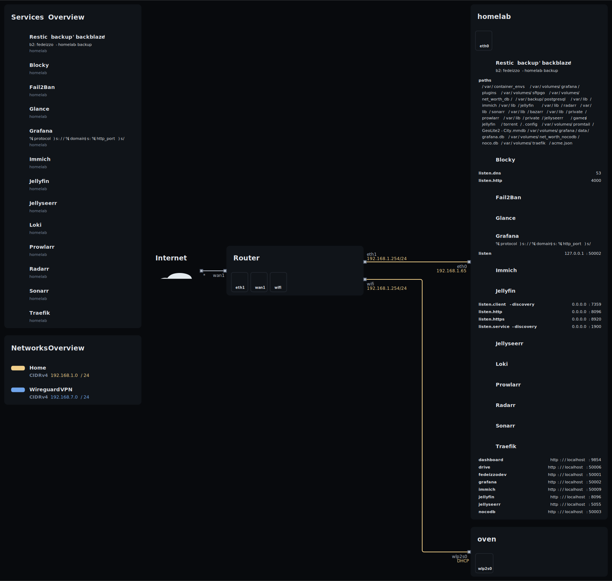
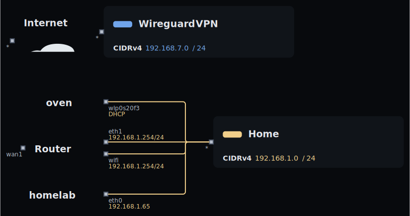

# Nix dotfiles

## Devices

- Homelab: Dell XPS 9510
- Personal laptop: Thinkpad X1 Nano
- Work laptop: Macbook pro M1 Max
- Backup homelab (inactive): Raspberry pi 4th gen

## Topology




## Repository structure
-  [home](home/): home manager configurations.
- 󰍹 [hosts](hosts/): host system configurations.
- 󱄅 [nix](nix/): flake modules.
- 󱧘 [overlays](overlays/): package overlays.
-  [scripts](scripts/): system management scripts.
-  [secrets](secrets/): secrets.

## Usage
You can use [direnv](https://direnv.net/) to easily manage the flake contained in the repository.

After executing `direnv allow`, you should have a shell powered by [devshell](https://numtide.github.io/devshell/) and by running `menu` you have an help message.

```sh
menu
```

```
  [[general commands]]

    menu                             - prints this menu

  [ System installation]

    erase-disk-and-install-raspberry -  Raspberry Pi4 8Gb.
    erase-disk-and-install-x1.       -  Thinkpad X1 Nano 6th generation.
    erase-disk-and-install-xps       -  Dell XPS 9510.

  [ System administration]

    clean                            -  Delete old generations and clean nix store.
    deploy-homelab                   -  Deploy the homelab configuration over ssh.
    plasma-manager                   -  Print the current plasma configuration.
    refresh                          -  Refresh the devshell.
    secrets                          -  Edit secrets.
    update                           -  Update the system configuration using the current flake and hostname.
    update-input                     -  Update a flake.nix input.

  [ Repository administration]

    topology                         -  Generate topology image
```

## System installation
The following instructions are valid for all machines except the Macbook pro.

In my personal laptops the disk is erased at every boot in order to obtain a complete immutable and declarative system. This is achieved using a BTRFS snapshot.

Obviously some data, logs, cache, etc. must survive the boot process, this is achieved using [impermanence](https://github.com/nix-community/impermanence).

Some useful readings:
- [erase with btrfs snapshot](https://mt-caret.github.io/blog/posts/2020-06-29-optin-state.html)
- [erase with zfs](https://grahamc.com/blog/erase-your-darlings)
- [erase with tmpfs](https://elis.nu/blog/2020/05/nixos-tmpfs-as-root/)
- [erase home](https://elis.nu/blog/2020/06/nixos-tmpfs-as-home/)

```sh
passwd root
su
git clone https://github.com/fedeizzo/nix-dotfiles.git
cd nix-dotfiles
nix develop
erase-disk-and-install-{machine}
```
